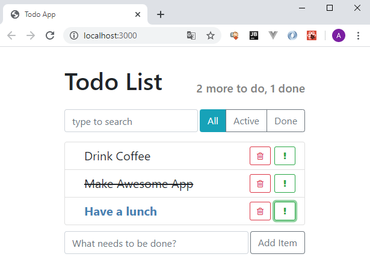

# Todo App
Первое react-приложение написанное в рамках учебного курса ["React + Redux - Профессиональная Разработка"](https://www.udemy.com/course/pro-react-redux/).

Представляет из себя todo-список с возможностями добавления/удаления/поиска/фильтрации задач. Имеющиеся задачи можно помечать как выполненные и как особо важные.

# Example

